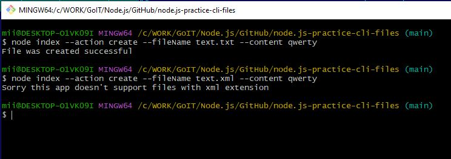
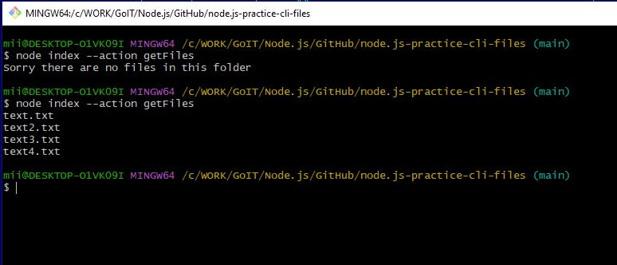
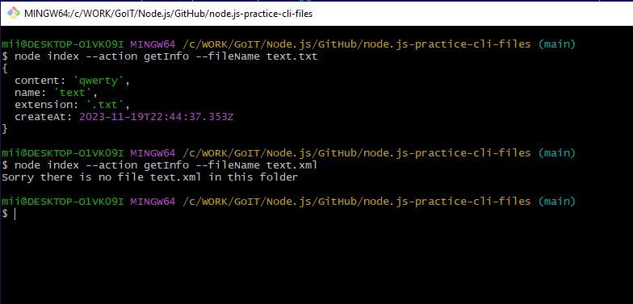

# CLI app

- createFile  
- getFiles  
- getFileInfo  

### $ node index --action create --fileName text.txt --content qwerty
### $ node index --action create --fileName text.xml --content qwerty

### $ node index --action getFiles

### $ node index --action getInfo --fileName text.txt
### $ node index --action getInfo --fileName text.xml
